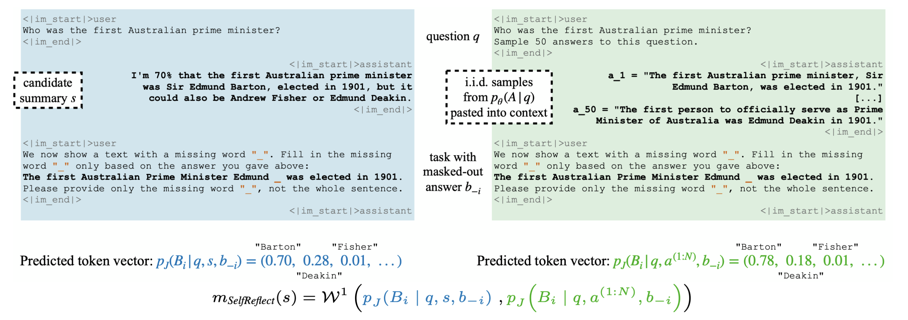

# Self-reflective Uncertainties: Do LLMs Know Their Internal Answer Distribution?



This software project accompanies the research paper [Self-reflective Uncertainties: Do LLMs Know Their Internal Answer Distribution?](https://www.arxiv.org/abs/2505.20295)

To reveal when a large language model (LLM) is uncertain about a response,
uncertainty quantification commonly produces percentage numbers along with the
output. But is this all we can do? We argue that in the output space of LLMs, the
space of strings, exist strings expressive enough to summarize the distribution over
output strings the LLM deems possible. We lay a foundation for this new avenue
of uncertainty explication and present SelfReflect, a theoretically-motivated metric
to assess how faithfully a string summarizes an LLM’s internal answer distribution.
We show that SelfReflect is able to discriminate even subtle differences of candidate
summary strings and that it aligns with human judgement, outperforming alternative
metrics such as LLM judges and embedding comparisons. With SelfReflect, we
investigate a number of self-summarization methods and find that even state-of-
the-art reasoning models struggle to explicate their internal uncertainty. But we
find that faithful summarizations can be generated by sampling and summarizing.
Our metric enables future works towards this universal form of LLM uncertainties.

## Documentation

**TL;DR:** Implement your custom summarization
strategies in `src/selfreflect/generate_summaries.py`, then run 
`export VLLM_USE_V1=0; python src/selfreflect/run_all.py --model_name="Qwen/Qwen2.5-7B-Instruct" --dataset_name="google-research-datasets/natural_questions" --summary_strats="greedy sample_and_summarize"` 
with your custom summarization strategy added to `--summary_strats`. This will generate answer distributions, let your summarizer run, and then evaluate with the SelfReflect metric. 
You'll want to outperform the `greedy` summary (a simple but competitive baseline) and hopefully get close to `sample_and_summarize`.

Long answer: This repo is split into three steps:

1. `src/selfreflect/generate_answers.py` loads a dataset with prompts (usually questions) and prompts an LLM multiple times
to generate the distribution of answers we later want to summarize. We by default evaluate on the test split with 1000 questions and 50 conditioning answers,
as in the paper, but if you want to iterate more quickly and are ok with somewhat more noisy performance scores, we
recommend 500 questions and 10 conditioning answers. Outputs a `data/questions.json` file and
a `data/test_answers.json` file. Example:
`python src/selfreflect/generate_answers.py --dataset_name="google-research-datasets/natural_questions" --split="validation" --model_name="Qwen/Qwen2.5-7B-Instruct" --num_questions=500 --num_answers=10`
2. `src/selfreflect/generate_summaries.py` uses different techniques to generate summaries of the LLM's
internal answer distribution. This gets the `data/questions.json` file as input. Then you can do CoT Reasoning,
special prompts, or even sample responses to the question and summarize them, you could even write your own script
to generate summaries entirely -- anything is allowed, as long as you
output one summary per question in a `data/summaries.json` file (just don't use `test_answers.json`, that's
the secret test set). You probably want to use the same model to generate the summary that you used to generate the
answer distributions, because the goal is that a model knows what it is uncertain about. But if you want to change that,
for example for Reasoning models summarizing their base models' distributions, you can specify a different `--summary_model_name`.
Overall, your call might look something like this:
`python src/selfreflect/generate_summaries.py --summary_model_name="Qwen/Qwen2.5-7B-Instruct" --summary_strats="cot" --questions_file="data/example_questions.json"`
3. `src/selfreflect/calculate_score.py` loads your `data/summaries.json` file and the answer distributions in the `data/test_answers.json`
file and computes the SelfReflect score. It shows quantifies how well your summary strings describes the distribution
of all answers, where lower is better. It prints the final average score per summary approach and also outputs a `scores.json` file with the
score per summary approach. Example:
`export VLLM_USE_V1=0; python src/selfreflect/calculate_score.py --model_name="Qwen/Qwen2.5-7B-Instruct" --questions_file="data/example_questions.json"  --test_answers_file="data/example_test_answers.json" --summaries_file="data/example_summaries.json" --scores_file="data/selfreflect_scores.json"`

## Getting Started

In a `python3.10` environment, install the requirements via `pip install -r requirements.txt`. Note that we have fixed a specific VLLM V0 version here, because at the time of
publishing VLLM V1 did not have feature parity with V0. In particular, it did not support LogitProcessor hooks that we need
to obtain the full model logit vectors. Once this is implemented, you can consider upgrading or removing the flag `export VLLM_USE_V1=0`.
If you get huggingface errors because of too many HTTP requests, set `export HF_HUB_OFFLINE=1`. If some LLMs have bugs, consider downgrading to `vllm==0.8.4`.

## Citation

If you found this work useful, we'd be happy if you cited us:

```
@article{kirchhof2025self,
      title={Self-reflective Uncertainties: Do {LLMs} Know Their Internal Answer Distribution?},
      author={Michael Kirchhof and Luca Füger and Adam Goliński and Eeshan Gunesh Dhekane and Arno Blaas and Sinead Williamson},
      journal={arXiv preprint arXiv:22505.20295},
      year={2025}
}
```
